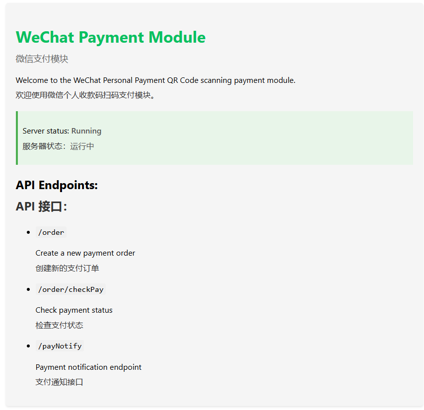

# 微信个人收款码：免签约支付模块
# WeChat Personal Payment QR Code Module

一个用于处理微信个人收款码支付的Node.js模块。开箱即用，不需要营业执照。Javascript集成
A Node.js module for handling payments through WeChat personal payment QR codes (微信个人收款码).

## 功能特点 | Features

- 生成动态计算金额的支付订单 | Generate payment orders with dynamically calculated payment amounts
- 通过解析微信支付通知消息验证支付 | Verify payments by parsing WeChat payment notification messages
- 处理并发支付请求 | Handle concurrent payment requests
- 通过分配唯一支付金额防止支付冲突 | Prevent payment collisions by assigning unique payment amounts
- 支持多种会员/产品类型 | Support for multiple membership/product types

## 工作原理 | How It Works

该模块使用巧妙的方法通过微信个人收款码验证支付：  
This module uses a clever approach to verify payments through WeChat personal QR codes:

1. 用户为特定产品/会员发起支付请求 | A user initiates a payment request for a specific product/membership
2. 系统生成唯一的支付金额（例如¥39.97而不是¥40.00） | The system generates a unique payment amount (e.g., ¥39.97 instead of ¥40.00)
3. 用户扫描微信二维码并支付准确金额 | The user scans the WeChat QR code and pays the exact amount
4. 微信发送支付通知消息 | WeChat sends a payment notification message
5. 系统解析通知消息并提取支付金额 | The system parses the notification message and extracts the payment amount
6. 系统匹配金额与待处理订单并更新支付状态 | The system matches the amount with pending orders and updates the payment status

## 前提条件 | Prerequisites

- Node.js (v14+)
- MySQL (v5.7+)
- 微信个人收款码图片（重命名为`skm.png`） | WeChat personal payment QR code image (renamed to `skm.png`)
- 支付成功图片（重命名为`success.png`） | Success image for successful payments (renamed to `success.png`)
- 支付超时图片（重命名为`expire.png`）| Payment overtime display image


### 服务器端 | Server-side

服务器端代码负责：  
The server-side code is responsible for:

- 创建和管理支付订单 | Creating and managing payment orders
- 处理支付通知 | Handling payment notifications
- 验证支付状态 | Verifying payment status
- 数据库操作 | Database operations


## 安装 | Installation

### 服务器端 | Server-side

1. 克隆仓库 | Clone the repository:
   ```
   git clone https://github.com/400yk/wechat-payment-module.git
   cd wechat-payment-module
   ```

2. 安装依赖 | Install dependencies:
   ```
   npm install
   ```

3. 基于`.env.example`创建`.env`文件 | Create a `.env` file based on the `.env.example`:
   ```
   cp .env.example .env
   ```

4. 添加您的二维码图片 | Add your QR code images:
   - 将您的微信支付二维码放在`imgs/skm.png` | Place your WeChat payment QR code as `imgs/skm.png`
   - 将成功图片放在`imgs/success.png` | Place your success image as `imgs/success.png`
   - 将超时图片放在`imgs/expire.png` | Place your timeout image as `imgs/expire.png`

5. 设置数据库 | Set up the database:
   ```
   mysql -u your_username -p < init_db.sql
   ```

### 安装疑难解答 | Installation Troubleshooting

如果您在安装过程中遇到问题，请尝试以下方法：  
If you encounter issues during installation, try the following:

1. 确保您使用的是Node.js 14或更高版本 | Make sure you're using Node.js 14 or higher:
   ```
   node -v
   ```

2. 如果bcrypt安装失败 | If bcrypt installation fails:
   - 本模块现在使用纯JavaScript实现的bcryptjs | This module now uses the pure JavaScript implementation bcryptjs
   - 不再需要安装本地编译工具 | No need for native build tools anymore

3. 权限问题 | Permission issues:
   - 在Windows上，尝试以管理员身份运行命令行 | On Windows, try running the command prompt as administrator
   - 在Linux/Mac上，不要使用sudo安装npm包 | On Linux/Mac, don't use sudo to install npm packages

4. 删除node_modules目录并重新安装 | Delete node_modules directory and reinstall:
   ```
   rm -rf node_modules
   npm install
   ```

## 使用方法 | Usage

### 服务器端 | Server-side

1. 启动服务器 | Start the server:
   ```
   npm start
   ```

2. API端点 | API Endpoints:
   - `POST /order` - 创建新的支付订单 | Create a new payment order
   - `GET /order/checkPay` - 检查支付状态 | Check payment status
   - `GET /payNotify` - 支付通知端点 | Endpoint for payment notification

### 客户端 | Client-side

```jsx
import React, { useState } from 'react';
import { PaymentDialog } from './path/to/wechat-payment-module/client/src';

function App() {
  const [isPaymentOpen, setIsPaymentOpen] = useState(false);
  const [amount, setAmount] = useState(0);
  
  const handlePaymentSuccess = (expirationDate) => {
    console.log('支付成功，到期日期:', expirationDate);
  };
  
  return (
    <div>
      <button onClick={() => { setAmount(39); setIsPaymentOpen(true); }}>
        支付会员费用
      </button>
      
      <PaymentDialog
        open={isPaymentOpen}
        onClose={() => setIsPaymentOpen(false)}
        amount={amount}
        apiBaseUrl="/api"
        onSuccess={handlePaymentSuccess}
        lang="zh" // 'zh' 为中文，'en' 为英文
      />
    </div>
  );
}
```

### 创建支付订单 | Creating a Payment Order

```javascript
// 客户端示例 | Client-side example
const response = await fetch('/order', {
  method: 'POST',
  headers: {
    'Content-Type': 'application/json'
  },
  body: JSON.stringify({
    orderNum: 'ORDER123',
    orderPrice: 39 // 价格（人民币元） | Price in yuan
  })
});

const data = await response.json();
// data.needPayFromServer包含需支付的确切金额 | data.needPayFromServer contains the exact amount to pay
// data.QRPayImage包含base64编码的二维码图片 | data.QRPayImage contains the base64 encoded QR code image
```

### 检查支付状态 | Checking Payment Status

```javascript
// 客户端示例 | Client-side example
const checkPayment = async () => {
  const response = await fetch(`/order/checkPay?orderNum=ORDER123&needPay=39`);
  const data = await response.json();
  
  if (data.message === '支付成功') {
    // 支付成功 | Payment successful
  } else {
    // 支付待处理 | Payment pending
    setTimeout(checkPayment, 3000); // 3秒后再次检查 | Check again in 3 seconds
  }
};
```

### 处理支付通知 | Processing Payment Notification

对于微信个人收款码，您需要配置获取支付通知的方式。可以通过：  
For WeChat personal payment codes, you need to configure a way to get the payment notifications. This could be through:

1. 手动输入通知文本 | Manual input of the notification text
2. 使用微信通知转发到邮箱 | Using WeChat's notification forwarding to email
3. OCR读取通知 | OCR reading of the notification

然后将通知发送到`/payNotify`端点：  
The notification is then sent to the `/payNotify` endpoint:

```
GET /payNotify?orderMsg=微信支付收款39.97元
```

## 与您的应用程序集成 | Integration with Your Application

### 服务器端集成 | Server-side Integration

该模块可以与您现有的Node.js应用程序集成：  
This module can be integrated with your existing Node.js application:

1. 复制相关目录：`controllers`、`routes/api`、`config`、`imgs` | Copy the relevant directories: `controllers`, `routes/api`, `config`, `imgs`
2. 将路由添加到您的Express应用程序 | Add the routes to your Express application:
   ```javascript
   app.use('/payNotify', require('./routes/api/payNotify'));
   app.use('/order', require('./routes/api/order'));
   ```
3. 确保您的认证中间件设置`req.user` | Ensure your authentication middleware sets `req.user`

### 客户端集成 | Client-side Integration

集成React组件到您的前端应用程序：  
Integrate React components into your frontend application:

1. 复制客户端代码 | Copy the client code:
   ```
   cp -r client/src/components/PaymentDialog.jsx path/to/your/app/src/components/
   cp -r client/src/components/PaymentDialog.css path/to/your/app/src/components/
   ```

2. 在您的应用程序中导入和使用 | Import and use in your application:
   ```jsx
   import PaymentDialog from './components/PaymentDialog';
   
   // ... 在您的组件中使用 | Use in your component
   ```

## 自定义 | Customization

- 修改`config/memberOfferings.js`以调整您的产品/会员供应 | Modify `config/memberOfferings.js` to adjust your product/membership offerings
- 自定义控制器中的SQL查询以适应您的数据库结构 | Customize the SQL queries in the controllers to fit your database structure
- 在控制器中调整超时值和并发支付限制 | Adjust timeout values and concurrent payment limits in the controllers
- 自定义客户端组件样式 | Customize client component styles

## 安全考虑 | Security Considerations

此模块设计用于个人使用和小型企业。它不包括：  
This module is designed for personal use and small businesses. It does not include:

- 强大的支付验证（依赖匹配支付金额） | Strong payment verification (relies on matching payment amounts)
- 支付网关安全措施 | Payment gateway security measures
- 符合金融法规 | Compliance with financial regulations

对于商业应用，请自行承担风险。  
Use at your own risk for commercial applications.

## 许可证 | License

MIT License. See the LICENSE file for details.

### 数据库结构

包含了订单表 (`orderList`) 和 用户会员表 (`user_membership`)。

```sql
-- 具体结构见 init_db.sql
```

## Screenshots

 